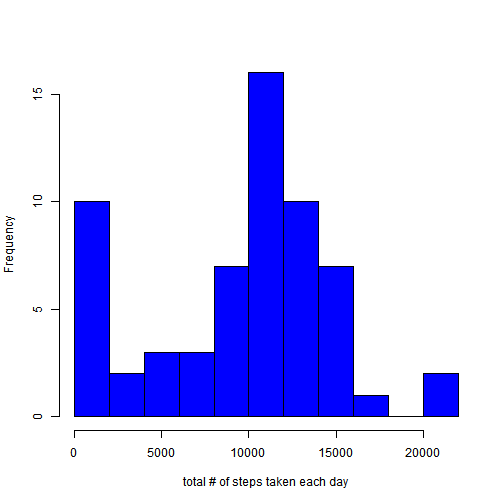

## Loading and pre-processing data
This analysis assumes the Activity monitoring data is unzipped and in the working directory.  
The lubridate library was used.


```r
act_mon_df <- read.csv("activity.csv", colClasses = "character")
act_mon_df$steps <- as.numeric(act_mon_df$steps)
act_mon_df$date <- ymd(act_mon_df$date)
act_mon_df$interval <- as.numeric(act_mon_df$interval)
```

## Mean total number of steps taken per day  
Code to calculate total number of steps taken per day.  
The dplyr library was used.  


```r
act_mon_df <- group_by(act_mon_df, date)
act_mon_day <- summarize(act_mon_df, daily_steps = sum(steps, na.rm=TRUE))
```

A histogram showing total # of steps taken each day:  


```r
# plot histogram
hist(act_mon_day$daily_steps,breaks=8,col="blue",xlab="total # of steps taken each day",main=NULL)
```

 


```r
mean_daily_steps <- mean(act_mon_day$daily_steps)
med_daily_steps <- median(act_mon_day$daily_steps)
```

The mean total number of steps taken per day is 9354.2295.  
The median total number of steps taken per day is 1.0395 &times; 10<sup>4</sup>.

## Average Daily Activity Pattern


```r
act_mon_df <- group_by(act_mon_df, interval)
act_mon_intvl <- summarize(act_mon_df, intvl_steps_mean = mean(steps, na.rm=TRUE))
intvl_max <- max(act_mon_intvl$intvl_steps_mean)
act_mon_intvl_f <- filter(act_mon_intvl, intvl_steps_mean == intvl_max)
interval_at_max <- act_mon_intvl_f$interval
interval_at_max_st <- interval_at_max - 5
ave_max_s <- toString(round(intvl_max,3))
```

Between the 830 and 835 interval, across all days, the maximum average number of steps per interval occurs.  
The histogram below provides a depiction, with the red line indicating the high activity interval, which is 206.17 steps.  

```r
yname <- "Average # of Steps per Interval"
xname <- "Time of Day [Example 2355 = 23:55 Military Time]"
plot(x=act_mon_intvl$interval, y=act_mon_intvl$intvl_steps_mean,type="l",col="purple",xlab=xname,ylab=yname)
abline(v=interval_at_max,col="red")
text(x=interval_at_max+140, y=intvl_max,labels=ave_max_s,col="red")
```

 

## Imputing Missing Values
Will use mean for 5 minute interval for any interval (rounded to nearest whole number) where there is an NA.


```r
act_mon_cc <- complete.cases(act_mon_df)
total_nas <- dim(act_mon_df)[1] - sum(act_mon_cc)
act_mon_imp <- left_join(act_mon_df, act_mon_intvl)
```

```
## Joining by: "interval"
```

```r
idx <- is.na(act_mon_imp$steps)
act_mon_imp$steps[idx] <- round(act_mon_imp$intvl_steps_mean[idx])
act_mon_imp_df <- group_by(act_mon_imp, date)
act_mon_imp_day <- summarize(act_mon_imp_df, daily_steps = sum(steps, na.rm=TRUE))
mean_daily_imp_steps <- mean(act_mon_imp_day$daily_steps)
med_daily_imp_steps <- median(act_mon_imp_day$daily_steps)
```
The total number of missing values in the data is 2304.    
The mean total number of steps taken per day is now 1.0766 &times; 10<sup>4</sup>.  
The median total number of steps taken per day is now 1.0762 &times; 10<sup>4</sup>.  
By using this strategy of imputing missing values, the mean and median increase and the distribution shifts away from values of 0.  
A histogram showing total # of steps taken each day after the imputing of values:  

```r
hist(act_mon_imp_day$daily_steps,breaks=8,col="green",xlab="total # of steps taken each day",main=NULL)
```

 

## Differences in Weekend and Weekday Activity Patterns


```r
act_mon_imp_df <- group_by(act_mon_imp, interval)
act_mon_imp_df$dayofweek <- weekdays(act_mon_imp_df$date)
act_mon_imp_df <- mutate(act_mon_imp_df, weekend = dayofweek %in% c("Saturday","Sunday"))
act_mon_imp_wkdy <- filter(act_mon_imp_df, weekend == FALSE)
act_mon_imp_wknd <- filter(act_mon_imp_df, weekend == TRUE)
act_mon_imp_wkdy <- group_by(act_mon_imp_wkdy, interval)
act_mon_wkdy_intvl <- summarize(act_mon_imp_wkdy, intvl_steps_mean = mean(steps, na.rm=TRUE))
act_mon_imp_wknd <- group_by(act_mon_imp_wknd, interval)
act_mon_wknd_intvl <- summarize(act_mon_imp_wknd, intvl_steps_mean = mean(steps, na.rm=TRUE))
```


Create cat column that indicates weekday or weekend


```r
act_mon_wkdy_intvl$cat <- "weekday"
act_mon_wknd_intvl$cat <- "weekend"
act_mon_wkdynd_intvl <- rbind(act_mon_wkdy_intvl, act_mon_wknd_intvl)
```

Using lattice library  
Plot below shows that weekday activity has more steps in the morning where as weekend activity is more dispersed throughout the day.  


```r
yl <- "Average # of Steps per Interval"
xl <- "Time of Day [Example 2355 = 23:55 Military Time]"
xyplot(intvl_steps_mean ~ interval | cat, data = act_mon_wkdynd_intvl, type="l", layout = c(1,2),xlab=xl,ylab=yl)
```

 
